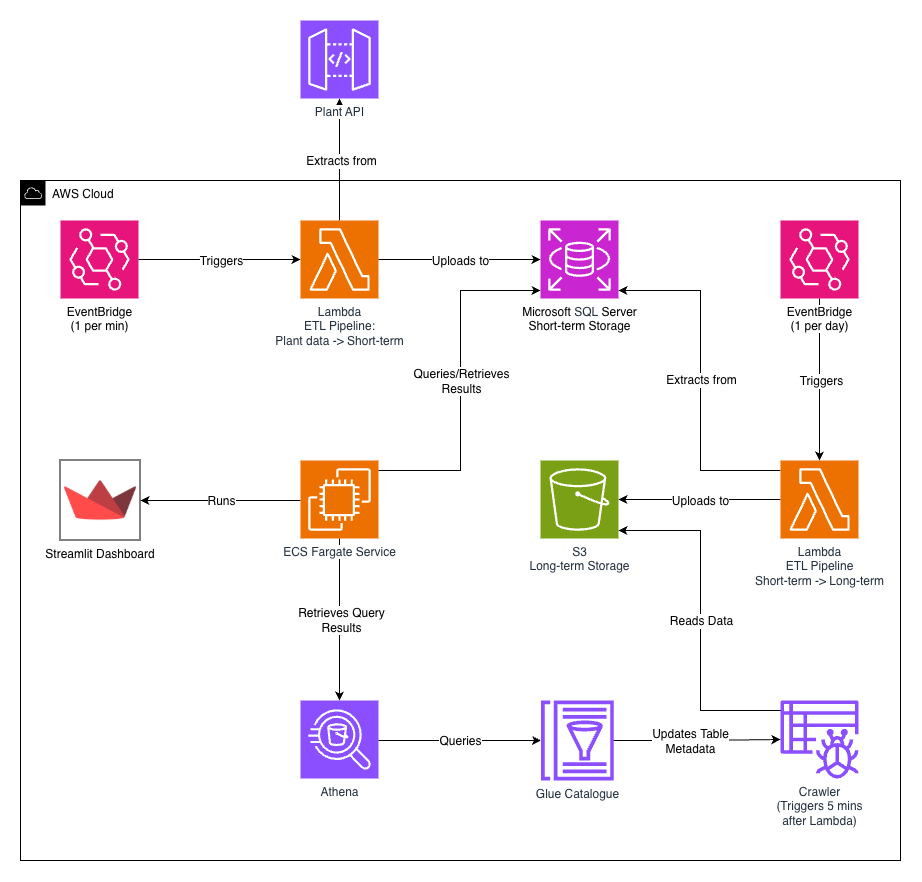

# LMNH Plant Health Pipeline

This repository contains the code for the LMNH Plant Health Pipeline, which processes and transforms live plant data for analysis and visualisation.

## Architecture Overview



The entire cloud system consists of a short term pipeline that pulls a batch of queried data for each plant in the museum every minute. This data is hosted within an API that returns data from one plant per request.

Every 24 hours there's a second pipeline which dumps all the RDS data onto an S3 bucket as time partitioned S3 files. After doing so, the script will delete all records within the RDS that are older than 24 hours.

## Project Structure

### pipeline/
- **extract/**: Contains scripts to extract raw plant data from various sources.
- **transform/**: Contains scripts to clean and transform the extracted plant data into the separate tables.
- **load/**: Contains scripts to load the transformed data into a Microsoft SQL Server database.
- **pipeline.py**: Main pipeline script, tying together extraction, transformation, and loading steps into one workflow.

### schema/
- **schema.sql**: Schema script to create database tables with necessary constraints.
- **load_schema_and_data.py**: Python script to load the schema and data into the database.

### terraform/
- Contains Terraform configuration files to set up the necessary cloud infrastructure for the pipeline.

## Getting Started
To get started with the LMNH Plant Health Pipeline, follow these steps:
1. Clone the repository.
2. Set up the required Python environment and install dependencies found in `pipeline/pipeline_requirements.txt`.
3. Configure the database connection settings in the `load/` scripts using a `.env` file.
4. Dockerise the pipeline and push the image to AWS ECR.
    - Follow the steps below to build and push the Docker image to AWS ECR.
5. Use the Terraform scripts in the `terraform/` directory to set up any required cloud infrastructure.
6. The pipeline will be triggered automatically on a schedule using AWS EventBridge.
    - This will extract the latest plant data, transform it, and load it into the Microsoft SQL Server database.

## Upload Docker Image to ECR

Note: Ensure the ECR_REPOSITORY_NAME matches the name used in your Terraform configuration.

### Authenticate Docker to ECR
```bash
aws ecr get-login-password --region {REGION} | docker login --username AWS --password-stdin {ACCOUNT_ID}.dkr.ecr.{REGION}.amazonaws.com
```
This command logs you into the ECR registry using Docker.

### Create the ECR Repository
```bash
aws ecr create-repository --repository-name {ECR_REPOSITORY_NAME} --region {REGION}
```
This creates a new ECR repository in a specific region.

### Build the Docker Image
```bash
docker buildx build -t {DOCKER_IMAGE_NAME} . --platform linux/amd64
```
This builds the Docker image for the pipeline on the correct platform.

### Tag the Docker Image
```bash
docker tag {DOCKER_IMAGE_NAME}:latest {ACCOUNT_ID}.dkr.ecr.{REGION}.amazonaws.com/{ECR_REPOSITORY_NAME}:latest
```
This tags the Docker image with the ECR repository URI.

### Push the Docker Image to ECR
```bash
docker push {ACCOUNT_ID}.dkr.ecr.{REGION}.amazonaws.com/{ECR_REPOSITORY_NAME}:latest
```
This pushes the tagged Docker image to the ECR repository.